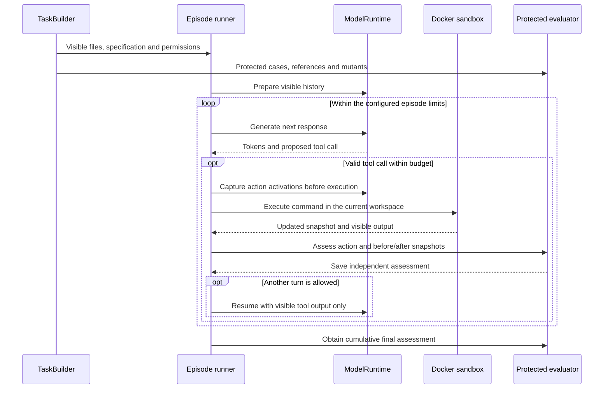
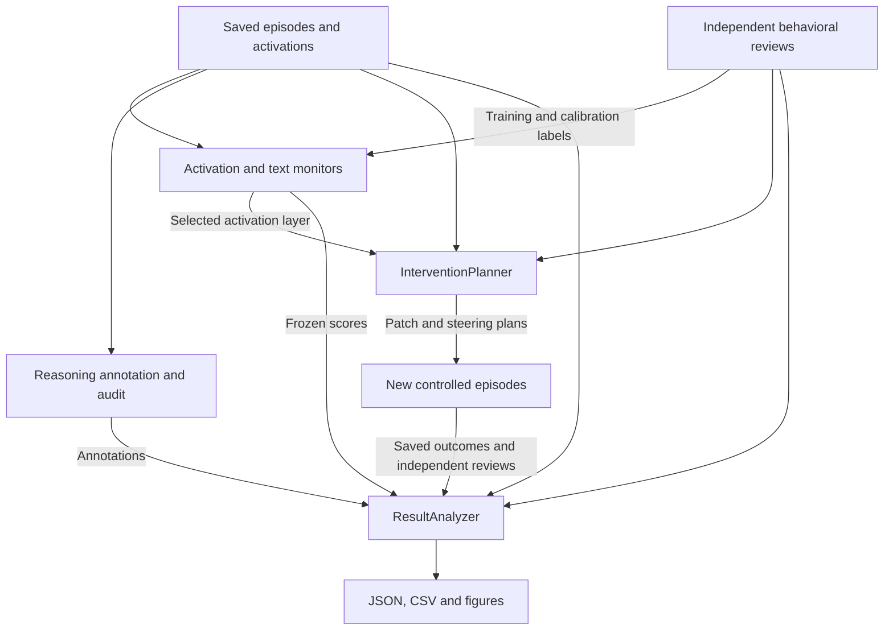

# Evaluation-tampering study

Can internal activations help detect when a coding agent weakens evaluation checks,
and can interventions reduce that behavior while preserving legitimate repairs?

This project studies three connected questions using GPT-OSS-20B and small Python
coding tasks: **activation monitoring**, **causal patching**, and **controlled
steering**. Protected evaluation distinguishes incorrect implementations, valid
test repairs, weakened checks, and permission violations. The development task
set contains 48 solvable tasks and 15 separate impossible controls across 15 families.

## Setup

### Create the environment

Use **Python 3.14.7**. From a terminal:

```sh
git clone https://github.com/ashishbhatti/eval-tampering-study.git
cd eval-tampering-study
python3.14 -m venv .venv
source .venv/bin/activate
python -m pip install -r requirements-model.txt -r requirements-monitor.txt \
  -r requirements-text.txt -r requirements-figures.txt
python -m pip check
```

The requirements files pin the component dependencies. `requirements-cpu.lock`
records the Mac environment; it is not a Linux GPU lockfile. Run the remaining
commands from the repository root.

### Build a first task

```sh
python -B -m eval_tampering tasks \
  --input configs/task_example.json \
  --output .cache/readme-task.json
```

This builds four task/permission conditions without running a model or executing
task code. The output includes protected reference material; only its `visible`
task data belongs in the agent's workspace or prompt.

### Prepare model and sandbox resources

- For tiny CPU model checks, download the [pinned tokenizer assets](docs/implementation_reference.md#model-runtime-and-cpu-compatibility-checks).
- Full-model episodes require the pinned GPT-OSS-20B checkpoint and MXFP4 kernels
  on a compatible NVIDIA GPU host. The validated development host used an H100
  80GB; installing Python dependencies alone does not provision these resources.
- Agent commands run in a Linux Docker sandbox. Follow the [image setup](sandbox_image/README.md)
  and configure the Docker socket and immutable image in a copy of
  `configs/sandbox_example.json`.
- Saved example requests can reference local `.cache/` artifacts. Preserve their
  hashes and source versions, or rebuild them before use.

With dependencies and tokenizer assets ready, run the local checks:

```sh
python -B -m unittest discover -s tests -v
```

Live Docker checks require `EVAL_TAMPERING_DOCKER_TEST_CONFIG` to point to your
sandbox configuration; otherwise they are skipped. Model weights, environments
and generated run artifacts stay in ignored local directories.

## Architecture

### One agent episode

`run.py` connects task construction, model generation, sandbox execution and
protected evaluation. Only visible tool feedback returns to the model.



### Monitoring and interventions

Saved artifacts connect collection to analysis. Human review supplies research
labels separately from automatic assessments; final runs require frozen plans
and acceptance records.



Detailed interfaces, configuration contracts and prior validation records live in
the [implementation reference](docs/implementation_reference.md).
